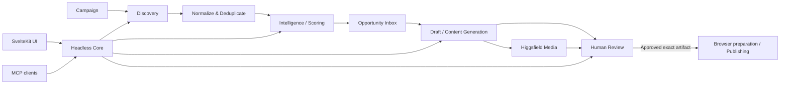

# Social Intelligence & Engagement Copilot

Reddit-first social intelligence and engagement platform. The system discovers public conversations, ranks meaningful opportunities, drafts useful responses and original content, generates optional media, and routes **every outbound action through explicit human approval**.

This `docs/` tree is the canonical specification. DOCX/PDF files, when produced, are exports for stakeholder circulation.

## Product shape

## Non-negotiable invariant

> No post, comment, message, vote, follow, or other outbound engagement may execute without an explicit human approval event for the exact artifact being sent. Edits invalidate approval.

## Documentation map

### Product
- [Product specification](product/product-spec.md)
- [User flows and UX](product/user-flows.md)
- [Opportunity scoring](product/opportunity-scoring.md)
- [Demo specification](product/demo-spec.md)

### Architecture
- [System design](architecture/system-design.md)
- [Reddit retrieval](architecture/retrieval.md)
- [AI / agent design](architecture/agents.md)
- [Approval and security](architecture/approval-security.md)
- [Data model](architecture/data-model.md)
- [API and MCP architecture](architecture/api-and-mcp.md)
- [Higgsfield media integration](architecture/media.md)
- [Workers, observability and testing](architecture/workers-observability-testing.md)

### API interfaces
- [REST/SSE API](api/rest-api.md)
- [MCP tools and resources](api/mcp-tools.md)

### Delivery
- [Roadmap](roadmap/roadmap.md)
- [Production readiness](roadmap/production-readiness.md)

### Research
- [Open-source projects](research/open-source-projects.md)
- [Reddit access, Gemini and CUA notes](research/reddit-access-and-gemini.md)
- [Retrieval benchmark](research/retrieval-benchmark.md)
- [Research source catalog](research/source-catalog.md)

### Architecture Decision Records
- [ADR index](adr/README.md)

## Recommended implementation stack

| Layer | Baseline |
|---|---|
| Backend | FastAPI + Pydantic + Pydantic AI |
| Persistence | PostgreSQL + SQLAlchemy 2 + Alembic |
| Jobs/cache | Redis + a lightweight Python worker queue initially |
| Frontend | Svelte 5 + SvelteKit + TypeScript |
| UI | shadcn-svelte + Bits UI |
| Frontend data | TanStack Query; Table/Virtual where useful |
| Browser/computer use | CUA + Gemini Computer Use where appropriate |
| Search/retrieval experiment | Gemini Google Search grounding + URL Context |
| Media | Higgsfield API |
| Agent interface | MCP over the same domain services as REST/SSE |

## Documentation conventions

1. Architecture-changing decisions require an ADR.
2. Specs describe desired behavior; ADRs explain **why** a major choice was made.
3. Public-platform capabilities and policy assumptions must be dated/revalidated before production decisions.
4. Example schemas are illustrative until an OpenAPI/JSON Schema artifact is committed.
5. Business logic lives in the headless core; UI, MCP, workers and providers are adapters around it.
