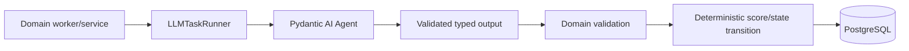

# Typed LLM Execution and Agent Design

> **Status:** Draft v0.3
> **Canonical:** Yes - this Markdown documentation is the source of truth.

Pydantic AI is the default typed LLM execution layer for bounded extraction, classification, synthesis, evaluation support, and generation. Tool-using agents are one use case, not the organizing abstraction for every model call.

## Control-plane boundary

```text
Application/domain workflow owns
  state transitions, provider routing, whole-job retries, idempotency,
  deterministic scoring, persistence, authorization, approval and audit

Pydantic AI execution owns
  model invocation, typed output validation, model-facing retries,
  optional narrow tools, per-run limits, streaming events and telemetry
```

Using Pydantic AI's `Agent` API for a one-turn structured-output call does not make that component autonomous. Name components after their domain purpose, such as `ConversationAnalyzer` or `ReplyDraftGenerator`, rather than calling every LLM Task an agent.

## Execution shape



`LLMTaskRunner` is a small internal boundary, not a generic workflow framework. Every run receives:

- stable `task_id` plus prompt and output-schema versions;
- requested model policy and allowed fallback policy;
- retry and usage limits;
- immutable dependencies and correlation metadata;
- a typed output contract and domain validators;
- an evaluation suite identifier.

## Initial LLM Task catalog

| Task | Typed output | Tools | Domain use |
|---|---|---|---|
| `extract_thread_fields` | `ExtractedThreadFields` | None | Optional extraction experiment after raw retrieval; not the deterministic baseline |
| `synthesize_thread` | `ThreadSynthesis` with positions, evidence references, unresolved questions | None normally | Conversation detail projection |
| `analyze_conversation` | `ConversationAnalysis` factors, rationale, confidence, recommended action | None | Inputs to deterministic scoring and Opportunity creation |
| `assess_claims_and_risk` | claims, evidence status, uncertainties, prohibited-claim flags | Optional read-only knowledge lookup | Draft validation support |
| `generate_reply_candidates` | typed `DraftCandidate` list | Optional read-only approved company knowledge | Creates immutable Draft Versions after domain validation |
| `generate_content_package` | platform variants and provenance | Optional read-only sources | Expansion milestone |
| `create_media_brief` | `MediaBrief` | None | Expansion milestone |
| `label_theme_cluster` | label and explanation | None | Labels a deterministic cluster; does not create membership |

Normalization, source-ID/URL deduplication, score calculation, lifecycle transitions, provider escalation, Approval, Approved Artifact creation, and Publish Preparation are not LLM Tasks.

## Analysis output

```python
class ConversationAnalysis(BaseModel):
    relevance: float
    pain_intensity: float
    buying_intent: float
    replyability: float
    product_fit: float
    promotion_fit: float
    confidence: float
    persona: str | None
    topic: str
    rationale: str
    recommended_action: Literal[
        "ignore",
        "monitor",
        "reply_helpfully",
        "reply_with_product",
        "content_opportunity",
    ]
```

Schema validity does not prove truth, calibration, community fit, or commercial usefulness. Deterministic range/business validation and frozen labeled evaluations remain outside the model call.

## Draft output

Prefer a typed `DraftCandidate` containing:

```text
text
posture
claims[]
source_refs[]
uncertainties[]
safety_flags[]
```

Only the final validated candidate is persisted as a new Draft Version. Partial streamed output is a UI preview, never canonical content. A valid model output is not an approved artifact.

## Model routing and fallback

- Select task models through versioned application configuration.
- Use lower-cost models for ordinary analysis and stronger models only for explicitly classified borderline/high-value cases.
- Keep quality escalation separate from availability fallback.
- Maintain a tested compatibility matrix because structured-output modes, tools, schemas, and model settings differ across providers.
- Do not let the model choose business routing, retry the whole workflow, or expand its own permissions.

## Retry ownership

| Layer | Owns |
|---|---|
| Provider transport | bounded network/rate-limit retries |
| Pydantic AI run | small output/tool retry budget for validation failures |
| Model fallback | configured provider/model availability failures |
| Worker/application | idempotent whole-task retry and recovery |

Every model retry may incur another request and cost. Attempt counts and failure classes are persisted. Whole-task retries use an idempotency key so a replay does not create duplicate Analyses or Draft Versions.

## Usage, provenance, and telemetry

Persist a `ModelRun` containing:

```text
task_id and task version
prompt version and output-schema version
requested and actual provider/model/settings
Pydantic AI run metadata
input/output hashes
request, token and estimated-cost usage
transport/output/tool retry counts
correlation IDs and timestamps
status and failure classification
redaction/retention policy
```

Pydantic AI usage limits constrain individual runs; campaign/workspace budgets and queue admission remain application concerns. OpenTelemetry traces aid operations but do not replace PostgreSQL audit or provenance records. Full prompts/completions are excluded by default unless an explicit retention and redaction policy permits them.

## Tools, dependencies, and permission safety

- Inject only narrow stage-specific dependencies and immutable context.
- Analysis and drafting may receive read-only source/company knowledge tools where necessary.
- They never receive publishing credentials, the publishing port, Approval creation, or browser submit capability.
- Dependency injection is a testability mechanism, not an authorization boundary; capability absence and server-side checks enforce permissions.
- Deferred tools may pause an interaction for review, but cannot authorize publishing.

## Evaluation strategy

Use one frozen Pydantic Evals dataset per LLM Task. Start with deterministic evaluators and add carefully scoped LLM judges only for subjective qualities.

| Task family | Evaluation focus |
|---|---|
| Extraction/synthesis | field/evidence completeness, unsupported statements, source-reference accuracy |
| Analysis | factor agreement, calibration, recommended-action agreement, subgroup error analysis |
| Drafting | helpfulness, factuality, naturalness, promotion appropriateness, community fit, claim safety |
| Media briefs | objective/constraint completeness and consistency with approved content |

Retrieval Precision@K, NDCG, provider overlap, completeness, and cost/useful-opportunity remain product metrics, not generic Pydantic Evals outputs.

## Framework posture

- Pin a tested Pydantic AI v2-compatible dependency range rather than floating on latest.
- Prefer the high-level `Agent` API for most typed calls, including non-agentic single-turn tasks.
- Use the low-level direct model API only when raw request/response control justifies implementing validation, retries, limits, and instrumentation separately.
- Keep the prototype on Redis-backed workers. Pydantic AI durable integrations do not create durability unless the application adopts and operates a supported workflow runtime.

See [ADR-002](../adr/002-pydantic-ai-primary-orchestrator.md), [ADR-005](../adr/005-bounded-agents-deterministic-workflows.md), [Human Approval and Security](approval-security.md), and the [Pydantic AI research note](../research/pydantic-ai-capabilities.md).
