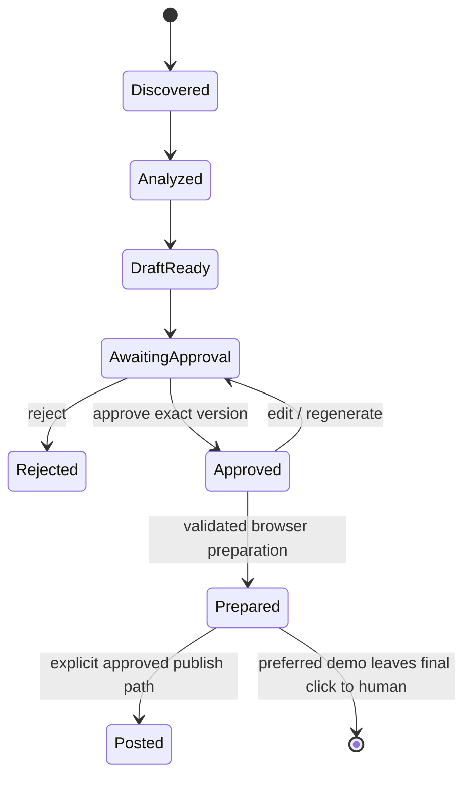

# Human Approval and Security

> **Status:** Draft v0.1  
> **Canonical:** Yes - this Markdown documentation is the source of truth.

Defines the outbound-action trust boundary, exact-content approval mechanism, browser safety model and core security controls.



## Human approval and publishing security

Human approval is not a prompt-level preference. It is enforced by database state, authorization checks, content hashing, and tool separation.


```text
DISCOVERED -> ANALYZED -> DRAFT_READY -> AWAITING_APPROVAL
|
reject | approve
v
APPROVED
|
publish job allowed
v
POSTED
```


| **Control**                  | **Design**                                                                                                                 |
|------------------------------|----------------------------------------------------------------------------------------------------------------------------|
| Exact artifact approval      | Approval references draft_version_id and SHA-256 of the exact outbound text/media selection.                               |
| Edit invalidation            | Any change after approval creates a new version and removes publish eligibility until re-approved.                         |
| Separated workers            | Research worker cannot engage. Publishing worker accepts only approved artifact IDs, never arbitrary text.                 |
| Authentication/authorization | Approval UI and sensitive APIs require authenticated user identity; model-level approval is not an authorization boundary. |
| Audit                        | Record who approved, when, what content, destination, source opportunity, and later publish result.                        |
| Safe demo mode               | CUA navigates and fills the composer, then stops before the final Reddit submit click.                                     |

## Security and privacy controls

| **Risk**                              | **Control**                                                                                                                                                                            |
|---------------------------------------|----------------------------------------------------------------------------------------------------------------------------------------------------------------------------------------|
| Prompt injection from web content     | Treat page text as untrusted data; constrain CUA task; Gemini Computer Use supports prompt-injection detection/safety features; never let page instructions redefine tool permissions. |
| Credential leakage                    | Keep browser session secrets in dedicated secret storage/sandbox; do not expose cookies to model output or application logs.                                                           |
| Unauthorized publishing               | No write tools in research agent; server-side approval validation; immutable content hash.                                                                                             |
| Cross-tenant leakage                  | Workspace-scoped queries, authorization checks in domain service, and tenant keys in job payloads.                                                                                     |
| Excessive retention of public content | Store only required excerpts/normalized data; configurable retention and deletion/re-fetch policy.                                                                                     |
| Browser abuse / blocking              | Rate limits, conservative concurrency, human-like bounded navigation without stealth circumvention, and provider backoff.                                                              |

## Security invariant

Approval is a server-side authorization fact, not an LLM conversation state. The publishing path must verify the approved draft version and content checksum at execution time. Research workers have no write capability.

See [ADR-003](../adr/003-human-approval-exact-content-gate.md) and [ADR-007](../adr/007-human-final-submit-demo-mode.md).

## Research references

See the [research source catalog](../research/source-catalog.md) for the primary documentation and open-source repositories used during the initial design.
