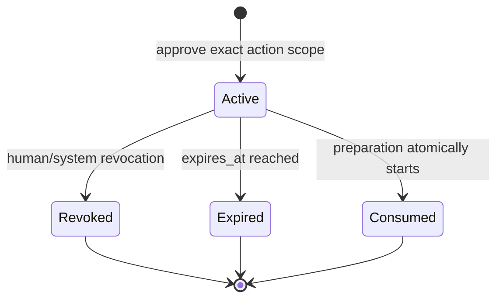

# Human Approval and Security

> **Status:** Draft v0.2
> **Canonical:** Yes - this Markdown documentation is the source of truth.

Human approval is a server-side authorization decision for one exact outbound action. It is not a prompt preference, client-supplied conversation state, Pydantic AI deferred-tool approval, or a mutable flag on a Draft.

## Authorization model

```text
Human review
    |
    v
Approval
  human decision: who approved which DraftVersion and when
    |
    v
ApprovedArtifact
  immutable authorization snapshot and digest
    |
    v
PublishPreparation
  single-use, revalidated execution attempt
    |
    v
READY_FOR_HUMAN
  prototype stops before final submit
```

The Approved Artifact binds:

```text
DraftVersion and exact text SHA-256
+ ordered media asset IDs and SHA-256 values
+ action type
+ ActorAccount
+ exact Destination
+ approved_by and approved_at
+ expires_at and revocation state
+ max_uses = 1
```

Changing any bound value requires a new Approval and Approved Artifact.

## Destination scope

A Destination is platform-specific but fully resolved before approval. For a Reddit comment it includes:

```json
{
  "platform": "reddit",
  "subreddit": "cybersecurity",
  "thread_id": "abc123",
  "parent_comment_id": null
}
```

The platform, community, thread, parent comment, action type, and Actor Account cannot be substituted during browser preparation.

## Approval lifecycle



- Approvals are short-lived and single-use by default. The default duration is configuration, but the expiry is explicit on every record.
- Revocation is append-audited and immediately removes eligibility.
- Consumption uses an atomic database transition. A failed browser attempt does not silently reset eligibility; an authorized retry policy must decide whether to resume the same preparation or require re-approval.
- A changing conversation does not automatically mutate approval. Operators may revoke manually, and policy may require fresh review when source context has materially changed.

## Legal execution path

1. A human edits or regenerates a Draft, producing a new immutable Draft Version.
2. The review service validates the Draft Version, finalized media assets, Actor Account, Destination, action type, and expiry.
3. One transaction records the Approval and immutable Approved Artifact.
4. The publishing API accepts only `approval_id`.
5. The publishing worker loads the artifact, revalidates ownership/status/expiry/revocation/use count and atomically consumes it.
6. Browser preparation uses only the artifact snapshot and returns `READY_FOR_HUMAN`.
7. In the preferred prototype, no callable capability performs final submit.

## Controls

| Control | Design |
|---|---|
| Immutable content | Draft Versions and finalized Media Assets cannot be modified. |
| Complete scope | Artifact digest covers content, media, destination, Actor Account, and action type. |
| No overrides | Publish Preparation has no fields for outbound text, media, destination, account, or action. |
| Separated capabilities | Research and LLM-task workers receive no publishing credentials or publishing port. |
| Human identity | Approval requires an authenticated, authorized human principal. |
| Execution validation | Authorization is checked at request time and immediately before browser execution. |
| Expiration/revocation | Inactive approvals fail closed with stable reason codes. |
| Audit | Record decision, artifact digest, preparation evidence, state transitions, and final human handoff. |

## Pydantic AI boundary

Pydantic AI deferred tools may pause an agent interaction and route work to a reviewer, but that mechanism is not the product authorization boundary. Neither deferred-tool results nor client-supplied model history can create Approval, Approved Artifact, or publish eligibility. Only the Review domain service may do so after authenticating the human and validating the complete action scope.

## Browser and retrieval security

| Risk | Control |
|---|---|
| Prompt injection from source content | Treat retrieved text as untrusted data; use fixed task instructions and typed outputs; never let page content expand capabilities. |
| Credential leakage | Isolate browser sessions and external account credentials; redact logs and model telemetry. |
| Access-control evasion | Stop on CAPTCHA, authentication gates, explicit blocks, and policy-classified rate limits; do not rotate proxies, fingerprints, sessions, or identities to bypass them. |
| Cross-workspace leakage | Verify workspace ownership across Draft Version, media, Actor Account, Destination, Approval, and preparation. |
| Excessive retention | Apply approved source-retention, deletion/tombstone, screenshot, prompt, and completion policies. |

## Required invariant tests

- Reject missing, expired, revoked, consumed, cross-workspace, or digest-mismatched artifacts.
- Reject a one-character text change, different media ordering/checksum, different destination, different Actor Account, or different action type.
- Reject all Publish Preparation request fields other than `approval_id` and idempotency metadata.
- Prove two concurrent preparations cannot consume the same artifact.
- Prove research/MCP/LLM-task paths cannot import or invoke the publishing capability.
- Prove the prototype browser task has no final-submit action.

See [Domain Model and State Machines](domain-model.md), [REST and SSE API](../api/rest-api.md), [ADR-003](../adr/003-human-approval-exact-content-gate.md), [ADR-007](../adr/007-human-final-submit-demo-mode.md), and [ADR-010](../adr/010-separate-approval-from-approved-artifact.md).
