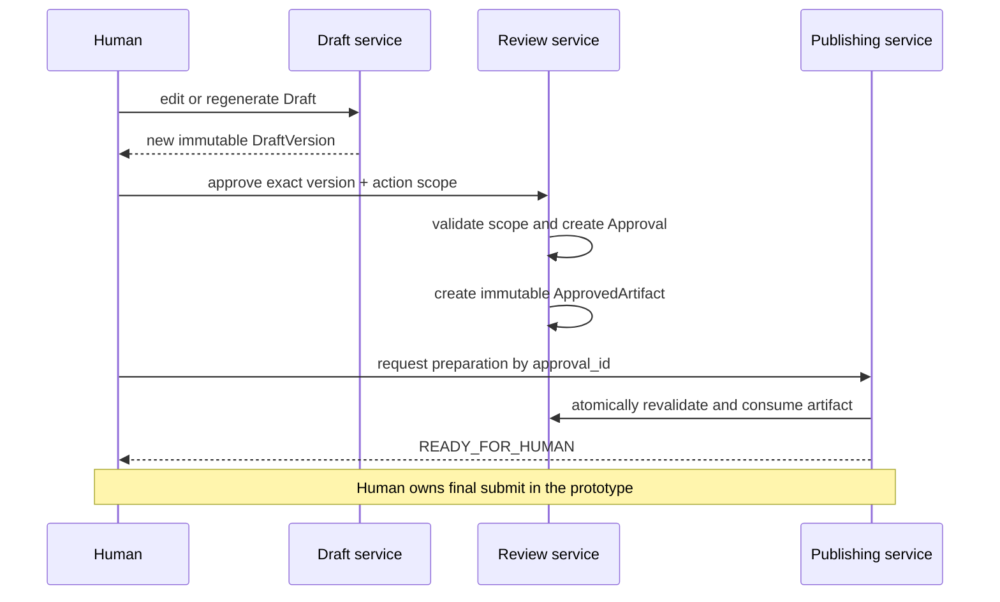

# Domain Model and State Machines

> **Status:** Draft v0.2
> **Canonical:** Yes - this Markdown documentation is the source of truth.

This document defines aggregate ownership, lifecycle, and cross-module invariants. The persistence inventory in [PostgreSQL Data Model](data-model.md) must implement these semantics rather than inventing alternate state transitions.

## Aggregate boundaries

| Aggregate | Owns | Important references | Does not own |
|---|---|---|---|
| Campaign | targeting, product context, source settings, lifecycle | Workspace | provider implementation |
| Discovery Run | bounded query execution and provider outcomes | Campaign, Retrieval Observations | canonical Conversations |
| Conversation | normalized source identity and items | Retrieval Observations by provenance | Campaign-specific scoring |
| Opportunity | Campaign-specific score, disposition, explanation | Campaign, Conversation, Analysis | Draft content |
| Draft | stable creative work identity and immutable Draft Versions | Opportunity or content theme | Approval authority |
| Review | Approval decisions and Approved Artifacts | Draft Version, media assets, Actor Account | browser execution |
| Publishing | Publish Preparations and their execution evidence | Approved Artifact | content editing or authorization creation |

## Lifecycle

```text
Campaign

DRAFT -> ACTIVE -> PAUSED -> ACTIVE
             |         |
             +---------+----> ARCHIVED
```

```text
DiscoveryRun

QUEUED -> RUNNING -> SUCCEEDED
                  -> PARTIAL
                  -> FAILED
                  -> CANCELLED
```

```text
Opportunity

OPEN -> SAVED
     -> DISMISSED
     -> ACTED_ON
```

```text
Approval

ACTIVE -> REVOKED
       -> EXPIRED
       -> CONSUMED
```

```text
PublishPreparation

QUEUED -> RUNNING -> READY_FOR_HUMAN
                  -> FAILED
                  -> CANCELLED
```

Conversation and Draft Version do not need mutable lifecycle machines. A Conversation is reconstructed from timestamped observations and source state; a Draft Version is immutable after creation.

## Numbered invariants

| ID | Invariant |
|---|---|
| INV-001 | A Draft Version is immutable after creation. |
| INV-002 | Editing or regenerating a Draft always creates a new Draft Version. |
| INV-003 | An Approval references exactly one Draft Version. |
| INV-004 | Approval scope includes exact text, media asset checksums, destination, Actor Account, and action type. |
| INV-005 | An Approved Artifact is immutable and cryptographically binds its complete authorization scope. |
| INV-006 | A revoked, expired, or consumed Approval cannot authorize a Publish Preparation. |
| INV-007 | The Publish Preparation API accepts only an Approval identifier, resolves its Approved Artifact internally, and accepts no content, destination, account, action, or media overrides. |
| INV-008 | Approval consumption is atomic and `max_uses` is one by default. |
| INV-009 | Research and LLM-task workers cannot create Publish Preparations or receive publishing credentials. |
| INV-010 | Browser preparation cannot start without revalidating the Approved Artifact at execution time. |
| INV-011 | The preferred prototype workflow cannot invoke final submit. |
| INV-012 | Retrieval Observations are immutable evidence; normalization creates or updates canonical Conversations without overwriting that evidence. |
| INV-013 | Provider-specific models and SDK objects do not cross into the domain model. |
| INV-014 | LLM output validation cannot create Approval, Approved Artifact, or publish eligibility. |
| INV-015 | Partial or streamed LLM output is never authoritative domain state. |

## Draft and approval sequence



## Concurrency rules

- Version numbers are unique within a Draft and allocated transactionally.
- Approval creation fails if any referenced media asset is not immutable and checksum-addressable.
- Only one Publish Preparation may consume a single-use Approved Artifact. Competing attempts must resolve through a database constraint or compare-and-set transition, not process-local locks alone.
- Expiration and revocation are checked both when preparation is requested and immediately before browser execution.
- A new Draft Version does not mutate an existing Approval; it simply has no authorization until separately approved.

See [Human Approval and Security](approval-security.md), [REST and SSE API](../api/rest-api.md), and [ADR-010](../adr/010-separate-approval-from-approved-artifact.md).
