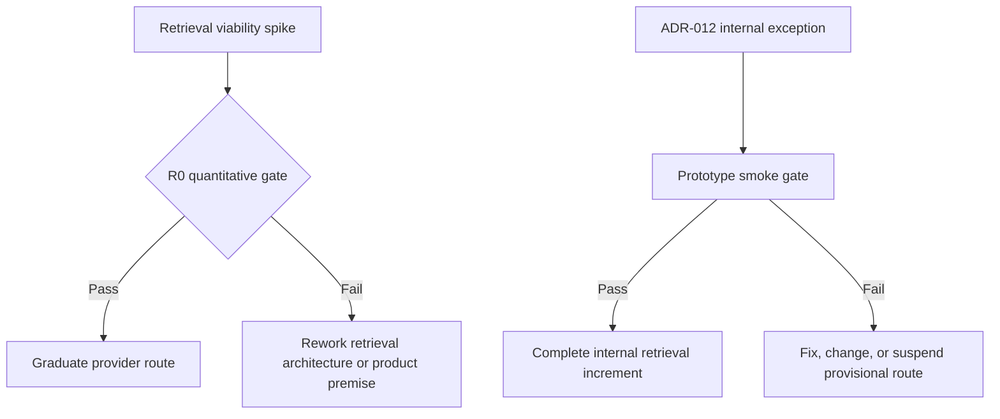

# Reddit Retrieval Architecture

> **Status:** Draft v0.4
> **Canonical:** Yes - this Markdown documentation is the source of truth.

Retrieval is the product's primary technical uncertainty. Full Retrieval Gate R0 remains required for provider graduation and any future external use. [ADR-012](../adr/012-time-boxed-internal-retrieval-selection.md) creates a dated exception allowing the project team to build the Internal Product with exact provisional variants after a smaller smoke gate. The architecture separates discovery from known-thread fetching because providers rarely support both capabilities equally well.

## Gate R0



Before R0 passes, ADR-012 permits vertical-slice implementation and product-level polish for team-only operation. Content Studio, Higgsfield integration, broad MCP, analytics, and bonus connectors remain deferred expansion.

The frozen protocol and thresholds are defined in [Retrieval Gate R0](../research/retrieval-benchmark.md).

## Capability-specific ports

```python
class RedditDiscoverySource(Protocol):
    async def discover(self, query: DiscoveryQuery) -> list[Candidate]: ...
    async def healthcheck(self) -> ProviderHealth: ...


class RedditThreadFetcher(Protocol):
    async def fetch_thread(self, locator: ThreadLocator) -> FetchResult: ...
    async def healthcheck(self) -> ProviderHealth: ...


class RedditPublisher(Protocol):
    async def prepare(
        self, approved_artifact: ApprovedArtifact
    ) -> PreparedPublish: ...
```

Search can discover URLs without fetching complete threads; Crawlee can fetch a known URL without implementing Reddit search. Separate ports prevent unsupported methods and keep escalation in application code. The publishing port remains separate in interface, credentials, process, and deployment permissions.

## Provisional Internal Product route

Through the ADR-012 review on 2026-09-20, the selected route is:

```text
Campaign query
  -> ObscuraDuckDuckGoLiteDiscoverySource
  -> canonical Reddit thread Candidate
  -> ObscuraRedditThreadFetcher
  -> immutable Retrieval Observation
  -> deterministic normalization
```

Both adapters run behind project-owned narrow interfaces with pinned Obscura/browser/configuration identity and retained raw evidence. They use anonymous standard navigation only. Accounts or authenticated sessions, CAPTCHA continuation, stealth, residential proxies, proxy rotation, and identity rotation are not authorized. Passing the separate prototype smoke gate completes the internal retrieval increment but does not pass R0.

No adapter silently hops to another provider. An operator may explicitly rerun Google, supported Brave Search API, Bing/Edge-index, or another separately configured variant; that run creates a distinct observation and preserves its own outcome.

## Candidate adapters

```text
RedditDiscoverySource
├── ObscuraDuckDuckGoLiteDiscoverySource  ADR-012 provisional internal default
├── AsyncPrawDiscoverySource        approved Reddit Data API only
├── SearchApiDiscoverySource        authenticated search API experiment
├── SearchPageDiscoverySource       separately reviewed HTML/Lite experiment
├── ApifyActorDiscoverySource       exact pinned Actor experiment only
└── CuaDiscoverySource              bounded last fallback

RedditThreadFetcher
├── ObscuraRedditThreadFetcher      ADR-012 provisional internal default
├── AsyncPrawThreadFetcher          approved Reddit Data API only
├── UrlContextThreadFetcher         current experiment
├── CrawleeHttpThreadFetcher        deterministic known-URL experiment
├── CrawleePlaywrightThreadFetcher  explicit browser experiment
├── ApifyActorThreadFetcher         exact pinned Actor experiment only
├── BrowserJsonThreadFetcher        isolated logged-in-browser experiment
└── CuaThreadFetcher                semantic/UI last fallback
```

Async PRAW adapters may share one internal read-only client and credential context, but SDK objects never escape into domain services. Synchronous PRAW is not the production choice for the async FastAPI/worker runtime.

These names describe project-owned adapters, not permission to install a general-purpose CLI in a research worker. Each concrete search API, HTML surface, managed Actor, or browser-session mechanism is a distinct provider variant with its own version, identity class, policy posture, rate budget, cost model, and evidence.

## Escalation policy

R0 compares methods rather than awarding the provisional choice automatic credit. The intended graduated-provider preference is:

1. Use an approved official Reddit Data API path through Async PRAW where its coverage satisfies the task.
2. Use an approved, explicitly configured search provider for public URL discovery when official discovery is unavailable or insufficient.
3. For known URLs, prefer the fastest compliant deterministic method meeting the completeness threshold: official API, URL Context, or Crawlee HTTP/Parsel according to measured results.
4. Escalate a technically incomplete result to Crawlee Playwright only when browser rendering is permitted and necessary.
5. Use CUA last for narrow cases requiring semantic visual navigation or irregular interaction.

Provider result classification controls escalation:

| Result | Routing behavior |
|---|---|
| `success` | Normalize and persist evidence. |
| `incomplete` | May escalate to the next benchmark-approved method. |
| `upstream_unavailable` | Retry only within the bounded transient budget; then optionally escalate. |
| `parse_failed` | Preserve the raw observation; retry only when deterministic and budgeted, otherwise optionally escalate. |
| `failed` | Unexpected terminal failure; preserve the exact reason and do not silently collapse an access/policy outcome into this class. |
| `blocked` | Stop and enter policy review; do not rotate around the block. |
| `auth_required` | Stop; no bypass or credential guessing. |
| `forbidden` | Stop; do not repeat with another identity or proxy. |
| `policy_disallowed` | Stop before access and retain the policy decision as evidence. |
| `rate_limited` | Respect backoff/admission control; do not switch identities to multiply quota. |
| `not_found` | Record terminal observation; do not browser-hop for a hidden copy. |

Fallback is policy-aware, not a reaction that conceals access denial. Outside the ADR-012 internal route, `incomplete` and exhausted transient `failed` results may move to another independently approved variant. Under ADR-012 there is no automatic fallback: persist the outcome and require an explicit operator rerun of another configured variant. A CAPTCHA, explicit block, authentication gate, forbidden response, or policy denial always stops that route; a scheduled comparative benchmark may still run another pre-authorized variant independently.

## Search and managed-provider variants

- Brave's supported Search API is an authenticated adapter requiring its own subscription token and plan-aware rate handling; it is not part of a keyless fallback.
- DuckDuckGo HTML and Lite are browser-facing search pages, not a documented full-search API contract. If evaluated, treat each as an experimental HTML-surface variant rather than a stable public endpoint.
- An Apify integration must pin the exact Actor and build/version, structured input, output schema, proxy setting, token scope, timeout, item and spend caps, and dataset retrieval behavior. `APIFY_TOKEN` authenticates an account; it does not select an Actor, enable residential proxies, or guarantee yield.
- Residential or rotating proxies do not authorize access and do not guarantee avoidance of blocks. They are disabled for Reddit access-control evasion.

Every provider enforces admission centrally across worker processes. Rate and spend controls are scoped at least by provider, credential/subscription, workspace, and egress identity; adapters honor `Retry-After` and provider reset headers with bounded backoff and jitter.

Telemetry distinguishes:

```text
domain job / query
provider attempt
top-level navigation or API call
browser/network subrequest
returned and deduplicated item
provider billable unit, proxy byte, browser minute, and model call
```

Do not describe pages, screenshots, or fallback stages as total HTTP-request counts unless transport instrumentation proves that count.

## Session-backed research variants

Agent Reach is not a retrieval SDK and is not a production dependency. Its underlying OpenCLI route may be benchmarked as a distinct logged-in-browser JSON variant because it can expose structured Reddit search/thread responses without visual CUA. The benchmark must use an audited, pinned, project-owned read-only adapter in an isolated process; the full upstream CLI is write-capable and must not be exposed to the research worker.

The `rdt-cli` cookie-authenticated web-JSON route is a higher-policy-risk diagnostic comparator only. Cookie copying, automatic browser-cookie extraction, browser-fingerprint impersonation, and anti-detection behavior are not eligible production mechanisms. Neither session-backed variant can satisfy R0's policy threshold without explicit access and commercial-use approval.

## Crawlee role

Crawlee is generic retrieval execution infrastructure, not a Reddit access solution. Gate R0 evaluates fixed HTTP/Parsel and Playwright variants for:

- request queueing and URL-level deduplication;
- retries, conservative throttling, and `Retry-After` handling;
- browser lifecycle and reproducible evidence capture;
- raw response/page snapshots and failure classification.

Constraints:

- Crawlee URL keys do not define Conversation identity; canonical Reddit IDs/fullnames do.
- Crawlee storage is transient. PostgreSQL and owned object storage remain canonical.
- Disable adaptive method selection in the benchmark because learned routing reduces reproducibility.
- Disable proxy, fingerprint, and session rotation as a Reddit evasion strategy.
- Stop on explicit blocks, CAPTCHAs, authentication gates, and policy-classified rate limits.
- The experimental `PydanticAiCrawler` is an extraction variant only. It is not the deterministic baseline; LLM retries can repeat cost, and plain HTTP cannot render JavaScript.

## Official Reddit provider

Async PRAW is the implementation choice if Reddit approves the intended use case. It provides structured Reddit IDs, listings/search, submissions, and comment forests, but it does not grant access or commercial permission.

The official provider must:

- use approved OAuth and a truthful descriptive User-Agent;
- request the least-privileged read scope and keep publishing credentials separate;
- coordinate credential-scoped rate budgets across worker instances;
- deliberately budget comment sorting and `MoreComments` expansion;
- implement source refresh and deletion/tombstone processing under the approved retention policy;
- expose explicit coverage and rate-limit telemetry.

## Retrieval evidence

Every attempt produces an immutable Retrieval Observation, including unsuccessful attempts:

```text
RetrievalObservation
  run_id
  provider, method, and provider_version
  source_url, final_url, external_source_id
  fetched_at
  result_status and response metadata
  raw_artifact_ref and raw_sha256
  extractor_version and normalized_sha256
  completeness and failure_reason
```

The pipeline is:

```text
Candidate
  -> Retrieval Observation
  -> deterministic normalization
  -> source-ID dedupe/upsert
  -> canonical Conversation
  -> bounded Pydantic AI analysis
```

Live retrieval is not deterministic. Reproducibility comes from pinned versions/configuration, fixed concurrency/throttling, immutable raw observations, deterministic normalization, and dated repeated benchmarks.

## Browser task boundary

A CUA or Playwright task is narrow and read-only: open a known public URL or perform an explicitly bounded search, collect permitted content, and return the normalized schema or a classified failure. Research workers have no tool for posting, commenting, messaging, voting, following, approving, or preparing an outbound action.

## Provider principles

- Installing a library grants no platform permission.
- Benchmark discovery and thread fetching independently.
- Treat every concrete Actor, API plan, HTML surface, browser-session transport, and credential class as a separately versioned provider variant.
- Persist provenance, completeness, cost, latency, and explicit failure class.
- Never convert an access denial into another evasion attempt.
- Treat Google's Reddit relationship as unrelated to the product's own API access.
- Select durable defaults by capability tier and quantitative evidence; any earlier provisional choice must be explicit, dated, and reversible.

See [ADR-004](../adr/004-reddit-provider-abstraction.md), [ADR-009](../adr/009-retrieval-viability-gate-and-escalation.md), [ADR-011](../adr/011-isolate-session-backed-retrieval-experiments.md), [ADR-012](../adr/012-time-boxed-internal-retrieval-selection.md), the [Crawlee/PRAW research note](../research/crawlee-praw-asyncpraw.md), [Agent Reach assessment](../research/agent-reach.md), and [third-party scraping-claims assessment](../research/third-party-scraping-claims.md).
