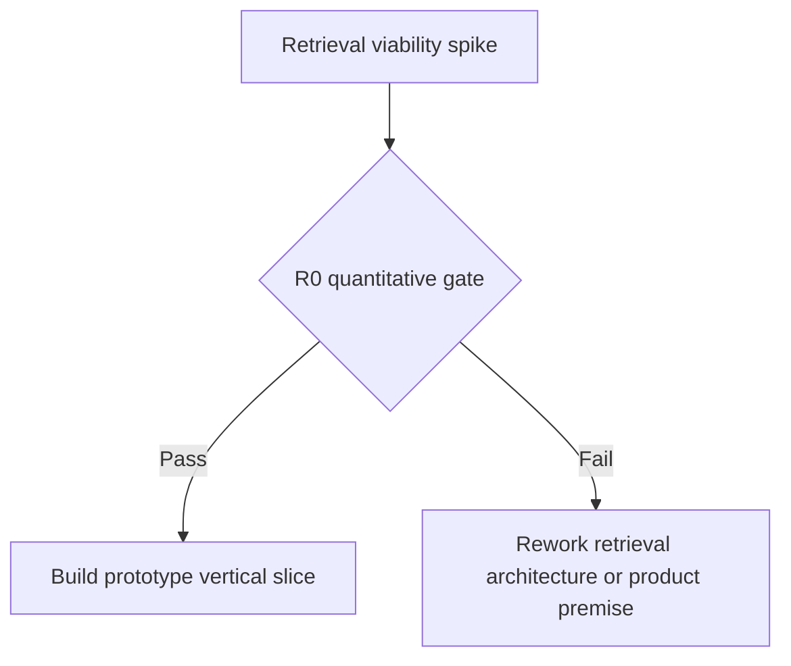

# Reddit Retrieval Architecture

> **Status:** Draft v0.2
> **Canonical:** Yes - this Markdown documentation is the source of truth.

Retrieval is the product's primary technical uncertainty and must pass Retrieval Gate R0 before the vertical slice is funded. The architecture separates discovery from known-thread fetching because providers rarely support both capabilities equally well.

## Gate R0



Before R0 passes, work may establish the domain/approval contracts and a minimal benchmark harness. Do not build Content Studio, Higgsfield integration, broad MCP, analytics, bonus connectors, or UI polish around an unproven acquisition path.

The frozen protocol and thresholds are defined in [Retrieval Gate R0](../research/retrieval-benchmark.md).

## Capability-specific ports

```python
class RedditDiscoverySource(Protocol):
    async def discover(self, query: DiscoveryQuery) -> list[Candidate]: ...
    async def healthcheck(self) -> ProviderHealth: ...


class RedditThreadFetcher(Protocol):
    async def fetch_thread(self, locator: ThreadLocator) -> FetchResult: ...
    async def healthcheck(self) -> ProviderHealth: ...


class RedditPublisher(Protocol):
    async def prepare(
        self, approved_artifact: ApprovedArtifact
    ) -> PreparedPublish: ...
```

Search can discover URLs without fetching complete threads; Crawlee can fetch a known URL without implementing Reddit search. Separate ports prevent unsupported methods and keep escalation in application code. The publishing port remains separate in interface, credentials, process, and deployment permissions.

## Candidate adapters

```text
RedditDiscoverySource
├── AsyncPrawDiscoverySource        approved Reddit Data API only
├── SearchDiscoverySource           public URL discovery experiment
└── CuaDiscoverySource              bounded last fallback

RedditThreadFetcher
├── AsyncPrawThreadFetcher          approved Reddit Data API only
├── UrlContextThreadFetcher         current experiment
├── CrawleeHttpThreadFetcher        deterministic known-URL experiment
├── CrawleePlaywrightThreadFetcher  explicit browser experiment
└── CuaThreadFetcher                semantic/UI last fallback
```

Async PRAW adapters may share one internal read-only client and credential context, but SDK objects never escape into domain services. Synchronous PRAW is not the production choice for the async FastAPI/worker runtime.

## Escalation policy

R0 compares methods rather than preselecting one winner. The intended production preference is:

1. Use an approved official Reddit Data API path through Async PRAW where its coverage satisfies the task.
2. Use an approved search provider for public URL discovery when official discovery is unavailable or insufficient.
3. For known URLs, prefer the fastest compliant deterministic method meeting the completeness threshold: official API, URL Context, or Crawlee HTTP/Parsel according to measured results.
4. Escalate a technically incomplete result to Crawlee Playwright only when browser rendering is permitted and necessary.
5. Use CUA last for narrow cases requiring semantic visual navigation or irregular interaction.

Provider result classification controls escalation:

| Result | Routing behavior |
|---|---|
| `success` | Normalize and persist evidence. |
| `incomplete` | May escalate to the next benchmark-approved method. |
| `failed` | Retry only if classified transient and within budget; then optionally escalate. |
| `blocked` | Stop and enter policy review; do not rotate around the block. |
| `auth_required` | Stop; no bypass or credential guessing. |
| `rate_limited` | Respect backoff/admission control; do not switch identities to multiply quota. |
| `not_found` | Record terminal observation; do not browser-hop for a hidden copy. |

## Crawlee role

Crawlee is generic retrieval execution infrastructure, not a Reddit access solution. Gate R0 evaluates fixed HTTP/Parsel and Playwright variants for:

- request queueing and URL-level deduplication;
- retries, conservative throttling, and `Retry-After` handling;
- browser lifecycle and reproducible evidence capture;
- raw response/page snapshots and failure classification.

Constraints:

- Crawlee URL keys do not define Conversation identity; canonical Reddit IDs/fullnames do.
- Crawlee storage is transient. PostgreSQL and owned object storage remain canonical.
- Disable adaptive method selection in the benchmark because learned routing reduces reproducibility.
- Disable proxy, fingerprint, and session rotation as a Reddit evasion strategy.
- Stop on explicit blocks, CAPTCHAs, authentication gates, and policy-classified rate limits.
- The experimental `PydanticAiCrawler` is an extraction variant only. It is not the deterministic baseline; LLM retries can repeat cost, and plain HTTP cannot render JavaScript.

## Official Reddit provider

Async PRAW is the implementation choice if Reddit approves the intended use case. It provides structured Reddit IDs, listings/search, submissions, and comment forests, but it does not grant access or commercial permission.

The official provider must:

- use approved OAuth and a truthful descriptive User-Agent;
- request the least-privileged read scope and keep publishing credentials separate;
- coordinate credential-scoped rate budgets across worker instances;
- deliberately budget comment sorting and `MoreComments` expansion;
- implement source refresh and deletion/tombstone processing under the approved retention policy;
- expose explicit coverage and rate-limit telemetry.

## Retrieval evidence

Every attempt produces an immutable Retrieval Observation, including unsuccessful attempts:

```text
RetrievalObservation
  run_id
  provider, method, and provider_version
  source_url, final_url, external_source_id
  fetched_at
  result_status and response metadata
  raw_artifact_ref and raw_sha256
  extractor_version and normalized_sha256
  completeness and failure_reason
```

The pipeline is:

```text
Candidate
  -> Retrieval Observation
  -> deterministic normalization
  -> source-ID dedupe/upsert
  -> canonical Conversation
  -> bounded Pydantic AI analysis
```

Live retrieval is not deterministic. Reproducibility comes from pinned versions/configuration, fixed concurrency/throttling, immutable raw observations, deterministic normalization, and dated repeated benchmarks.

## Browser task boundary

A CUA or Playwright task is narrow and read-only: open a known public URL or perform an explicitly bounded search, collect permitted content, and return the normalized schema or a classified failure. Research workers have no tool for posting, commenting, messaging, voting, following, approving, or preparing an outbound action.

## Provider principles

- Installing a library grants no platform permission.
- Benchmark discovery and thread fetching independently.
- Persist provenance, completeness, cost, latency, and explicit failure class.
- Never convert an access denial into another evasion attempt.
- Treat Google's Reddit relationship as unrelated to the product's own API access.
- Select defaults by capability tier and quantitative evidence, not architectural preference.

See [ADR-004](../adr/004-reddit-provider-abstraction.md), [ADR-009](../adr/009-retrieval-viability-gate-and-escalation.md), and the [Crawlee/PRAW research note](../research/crawlee-praw-asyncpraw.md).
