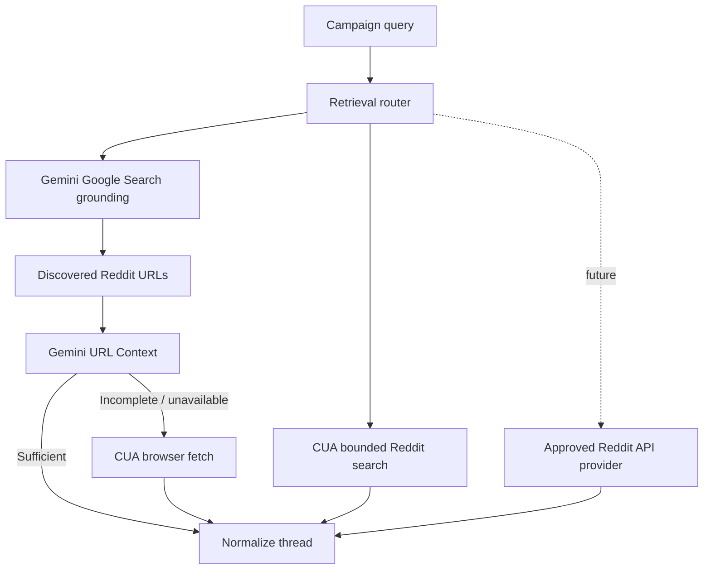

# Reddit Retrieval Architecture

> **Status:** Draft v0.1  
> **Canonical:** Yes - this Markdown documentation is the source of truth.

Defines the pluggable Reddit discovery and thread-extraction path for the MVP and the later official-provider path.



## Reddit retrieval architecture

The retrieval layer is intentionally pluggable. The MVP uses browser/search-based methods because Reddit developer approval is a separate process. Official API access can be introduced later without changing the opportunity/intelligence layers.


```text
Reddit query / campaign
|
v
Retrieval Router
| | |
| | +--> Future approved Reddit API provider
| +------------> Gemini Search + URL Context experiment
+---------------------> CUA browser agent
|
v
Normalized Reddit conversation
```


### Provider interface


```python
class RedditProvider(Protocol):
    async def discover(self, query: DiscoveryQuery) -> list[Candidate]: ...
    async def fetch_thread(self, locator: ThreadLocator) -> RedditThread: ...
    async def healthcheck(self) -> ProviderHealth: ...


# The write path is deliberately separate from the research provider.
class RedditPublisher(Protocol):
    async def prepare(
        self, approved_artifact: ApprovedArtifact
    ) -> PreparedPublish: ...
```


Read/research and publish permissions should be separate interfaces and separate credentials/processes. This prevents accidental expansion of a retrieval agent into an engagement agent.

### Retrieval escalation ladder

1. Use Google Search grounding to discover Reddit URLs for campaign queries and site-scoped searches.

2. Use Gemini URL Context where it can retrieve sufficient public page content.

3. Escalate incomplete/blocked cases to a CUA browser session that opens the exact page and extracts a narrow structured schema.

4. Persist the retrieval method, timestamp, source URL, and extraction confidence.

5. Never instruct browser agents to bypass authentication gates, CAPTCHAs, blocks, or other access controls.


> **Benchmark, do not assume.** Google has a Reddit Data API partnership, but that does not mean Gemini API customers receive Google's privileged Reddit feed. Treat Search + URL Context quality as an empirical retrieval path that must be benchmarked against direct browser discovery.


### Browser agent contract

The CUA task should be narrow and deterministic: open a known Reddit URL or perform a bounded search, read public content, scroll/expand where ordinary browser use permits, and return a typed record. The research agent has no tool for posting, commenting, messaging, voting, or following.


```json
{
  "source": "reddit",
  "url": "...",
  "subreddit": "...",
  "post_id": "...",
  "title": "...",
  "body": "...",
  "author": "...",
  "created_at": "...",
  "score": 0,
  "comment_count": 0,
  "comments": [
    {
      "author": "...",
      "body": "...",
      "score": 0,
      "depth": 0
    }
  ]
}
```

## Provider principles

- Read/research providers and publishing providers are separate interfaces with separate permissions.
- Persist provider, timestamp, URL, confidence and extraction provenance.
- Browser tasks must be narrow and read-only for discovery workers.
- Do not build bypass behavior for CAPTCHAs, authentication gates or explicit access blocks.
- Treat Search + URL Context as a benchmarked public retrieval technique, not privileged Reddit API access.

See also [ADR-004](../adr/004-reddit-provider-abstraction.md) and [ADR-006](../adr/006-cua-browser-for-mvp-retrieval.md).

## Research references

See the [research source catalog](../research/source-catalog.md) for the primary documentation and open-source repositories used during the initial design.
