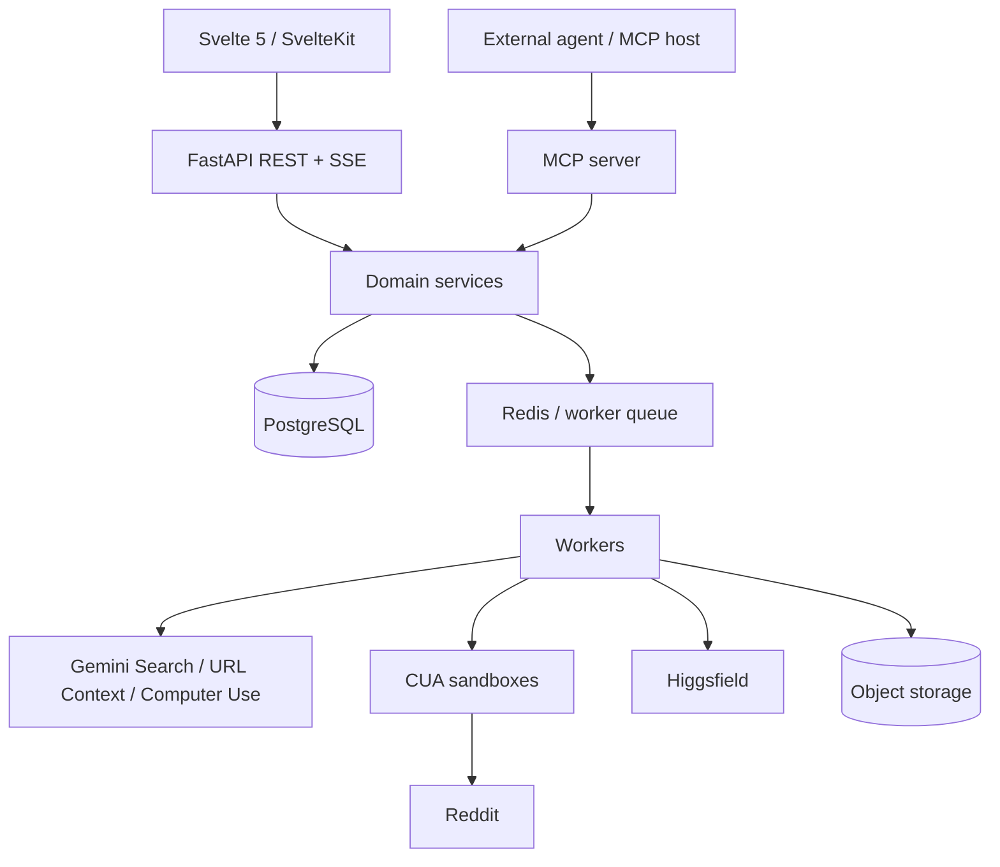

# System Design

> **Status:** Draft v0.1  
> **Canonical:** Yes - this Markdown documentation is the source of truth.

The platform is **headless-first**, with a first-party SvelteKit application and an agent-native MCP interface. Both call the same domain services and authorization rules; neither is the system of record. PostgreSQL is canonical state.



## Architecture decision

Build a headless core platform with a first-party SvelteKit client and a first-class MCP server. FastAPI exposes application APIs; PostgreSQL is the system of record; worker processes execute long-running retrieval, analysis, and media jobs. Pydantic AI provides typed, bounded AI steps. Browser automation is isolated behind a RedditProvider interface so the retrieval method can change without affecting the rest of the product.


> **Why not MCP-only?** MCP is excellent for agent access, but campaign configuration, bulk opportunity triage, visual comparison, edit/review, media selection, and approval are better first-party UI workflows. MCP is an adapter over the same domain services, not the canonical product state.

## Recommended technology stack

| **Layer**           | **Recommendation**                                      | **Rationale**                                                                                 |
|---------------------|---------------------------------------------------------|-----------------------------------------------------------------------------------------------|
| Web client          | Svelte 5 + SvelteKit + TypeScript                       | Fast, concise UI with good SSR/app ergonomics.                                                |
| UI system           | shadcn-svelte + Bits UI                                 | Accessible primitives plus composable application styling.                                    |
| Server state        | TanStack Query for Svelte                               | First-class Svelte support; fits API-heavy server state.                                      |
| Tables/large lists  | TanStack Table + Virtual as needed                      | Opportunity inbox and audit/history views benefit from sorting/filtering/virtualization.      |
| API                 | FastAPI + Pydantic                                      | Typed contracts, async endpoints, generated OpenAPI, Python AI ecosystem.                     |
| AI orchestration    | Pydantic AI                                             | Structured outputs, MCP integration, deferred tools/human approval, multiple model providers. |
| Database            | PostgreSQL + SQLAlchemy 2 + Alembic                     | Canonical relational state, JSONB for model payloads, migrations, strong constraints.         |
| Queue/cache         | Redis + lightweight worker framework                    | Retries, job coordination, locks, short-lived cache; avoid Kafka initially.                   |
| Browser execution   | CUA (trycua/cua) + browser runtime                      | Sandboxed computer-use execution and cross-OS driver abstractions.                            |
| Discovery/LLM tools | Gemini Search/URL Context/Computer Use where beneficial | Search grounding, URL retrieval, and native computer-use capabilities.                        |
| Generative media    | Higgsfield API                                          | One async API for images/video and webhook-based completion.                                  |

## Domain boundaries

| **Module**    | **Owns**                                                              | **Does not own**                    |
|---------------|-----------------------------------------------------------------------|-------------------------------------|
| Campaigns     | Targeting, product/ICP context, promotion posture, source settings.   | Retrieval implementation.           |
| Discovery     | Search jobs, provider routing, source provenance.                     | Marketing reasoning.                |
| Conversations | Normalization, canonical thread/post/comment entities, deduplication. | Draft generation.                   |
| Intelligence  | Analysis schema, scoring, themes, recommended actions.                | Publishing.                         |
| Creative      | Reply drafts, post drafts, content packages, media briefs.            | Approval authority.                 |
| Media         | Higgsfield requests, status, assets, storage metadata.                | Publishing decisions.               |
| Review        | Draft versions, approval records, rejection reasons, hashes.          | Direct data retrieval.              |
| Publishing    | Preparing or executing only approved outbound artifacts.              | Draft editing.                      |
| MCP           | Agent-facing projection of domain capabilities.                       | Independent business rules/state.   |
| Audit         | Immutable-ish event trail and provenance.                             | User-facing analytics calculations. |

## Deployment shape

```text
Web/App: SvelteKit
API: FastAPI
Worker: Python worker processes
Database: PostgreSQL
Queue/cache: Redis
Browser pool: isolated CUA sandboxes
Object store: S3-compatible storage for generated media
External: Gemini APIs, Higgsfield API
Interfaces: REST/SSE + MCP
```


For the MVP, a single application deployment plus one or more workers is sufficient. Do not split into microservices until scaling, isolation, ownership, or deployment cadence creates a concrete need.

## Technical decisions and open questions

| **Item**                  | **Decision / experiment**                                                                                                          |
|---------------------------|------------------------------------------------------------------------------------------------------------------------------------|
| Pydantic AI vs LangChain  | Use Pydantic AI as the primary orchestration layer; adopt isolated LangChain tools only if a specific integration justifies it.    |
| MCP vs headless REST      | Both: domain core first, REST/SSE for first-party UI, MCP for agents.                                                              |
| Reddit official API       | Not an MVP dependency; keep future provider slot and pursue approval separately.                                                   |
| Google Reddit partnership | Do not assume privileged Reddit content is exposed through Gemini API; benchmark public Search/URL Context behavior.               |
| Final click in demo       | Preferred demo stops with exact approved text filled and final Reddit submit left to the human.                                    |
| Workflow engine           | Start with Redis-backed workers; reevaluate Temporal/DBOS/Prefect only when durable, resumable workflows justify added complexity. |

## Research references

See the [research source catalog](../research/source-catalog.md) for the primary documentation and open-source repositories used during the initial design.
