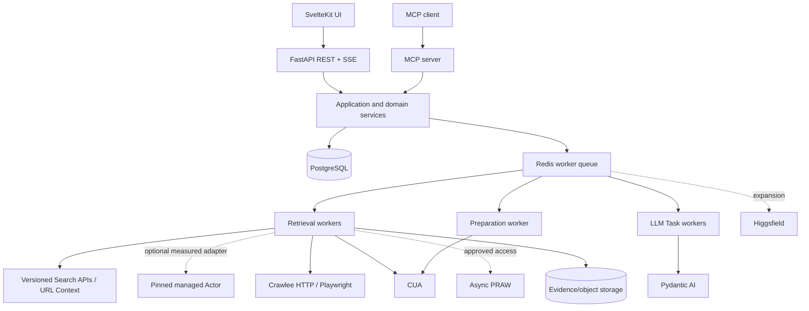

# System Design

> **Status:** Draft v0.3
> **Canonical:** Yes - this Markdown documentation is the source of truth.

The platform is headless-first, with a first-party SvelteKit application and an agent-native MCP adapter. Both call the same application/domain services and authorization rules; PostgreSQL is canonical state.



## Architecture decision

FastAPI exposes application APIs; PostgreSQL stores canonical domain state; workers execute long-running retrieval, model, browser, and later media work. Pydantic AI is the default typed LLM execution layer for both simple structured calls and bounded tool-using agents. Retrieval uses capability-specific discovery/fetch ports selected only after Gate R0.

MCP is valuable for agent access, but campaign configuration, bulk triage, source inspection, content diffs, account/destination selection, and approval are better first-party UI workflows. MCP remains a thin adapter rather than a second product state or authorization path.

## Recommended technology stack

| Layer | Recommendation | Rationale/status |
|---|---|---|
| Web client | Svelte 5 + SvelteKit + TypeScript | First-party operating and review surface |
| UI system | shadcn-svelte + Bits UI | Accessible composable primitives |
| Server state | TanStack Query for Svelte | API-heavy server state |
| Large lists | TanStack Table/Virtual as needed | Opportunity inbox projections |
| API | FastAPI + Pydantic | Typed async contracts and generated OpenAPI |
| Typed LLM execution | Pydantic AI v2-compatible pinned range | Structured outputs, validation, tools when needed, limits, evals, telemetry |
| Database | PostgreSQL + SQLAlchemy 2 + Alembic | Canonical state and authorization constraints |
| Queue/cache | Redis + lightweight worker framework | Prototype jobs, retries, coordination; avoid Kafka initially |
| Retrieval | R0-selected adapters behind discovery/fetch ports | Each Search API/plan, URL Context, Crawlee HTTP/Playwright, optional pinned managed Actor, isolated browser-JSON experiment and CUA is a distinct measured variant |
| Official Reddit | Async PRAW after approved access | Async structured provider; not an MVP dependency |
| Media | Higgsfield API in expansion | Optional, outside vertical-slice critical path |
| Object storage | S3-compatible | Immutable retrieval evidence and finalized media |

## Domain boundaries

| Module | Owns | Does not own |
|---|---|---|
| Campaigns | targeting, product/ICP context, promotion posture, source settings | retrieval implementation |
| Discovery | Discovery Runs, source routing, Candidate provenance | canonical thread identity or marketing reasoning |
| Conversations | Retrieval Observations, normalization, canonical source identity, deduplication/tombstones | Campaign-specific scoring |
| Intelligence | LLM Task inputs/outputs, deterministic scoring, Opportunities, explanations | publishing |
| Creative | Drafts and immutable Draft Versions | approval authority |
| Media | later media jobs, finalized assets, checksums, provenance | approval decisions |
| Review | human Approval and immutable Approved Artifact | browser execution |
| Publishing | Publish Preparation and execution evidence | editing, destination substitution, authorization creation |
| MCP | agent-facing projections of application capabilities | independent business rules/state |
| Audit | append-oriented decision, artifact, job, and provenance events | operational tracing alone |

## Deployment shape

```text
SvelteKit web application
FastAPI application + MCP adapter
Python worker processes separated by capability
PostgreSQL
Redis
isolated browser pool
S3-compatible evidence/media store
external model, retrieval, Reddit, and later media providers
```

For the prototype, one application deployment plus capability-separated workers is sufficient. Separation means credentials and callable ports differ even if processes share a repository/deployment unit. Do not split into network microservices without a concrete scaling, isolation, ownership, or deployment need.

## Gates and open decisions

| Item | Decision or experiment |
|---|---|
| Retrieval viability | Hard R0 gate with frozen queries/labels and explicit quality, completeness, reliability, latency, cost, evidence, and policy thresholds |
| Pydantic AI | Default typed LLM execution layer, including non-agentic calls; application remains control plane |
| Retrieval ports | Separate `RedditDiscoverySource` and `RedditThreadFetcher`; publishing stays separate |
| Crawlee | Benchmark HTTP/Parsel and fixed Playwright tiers; no evasion configuration; transient storage only |
| Search/managed providers | Authenticated APIs and exact Actor/build configurations only; tokens do not imply provider, proxy, yield or permission |
| Agent Reach | Reference engineering only; do not adopt its installer/router or expose its write-capable upstream CLIs in production workers |
| Reddit official API | Async PRAW implementation choice after approval; separate access/commercial-use workstream |
| MCP | Three read tools in the vertical slice; broader surface later |
| Final click | Preferred prototype stops with exact approved content ready and leaves submit to the human |
| Media | Higgsfield remains an expansion/wow feature, not a vertical-slice prerequisite |
| Workflow engine | Redis-backed workers first; reevaluate durable engines only on demonstrated multi-day/replay needs |

See [Domain Model and State Machines](domain-model.md), [Reddit Retrieval Architecture](retrieval.md), [Typed LLM and Agent Design](agents.md), and [Implementation Roadmap](../roadmap/roadmap.md).
